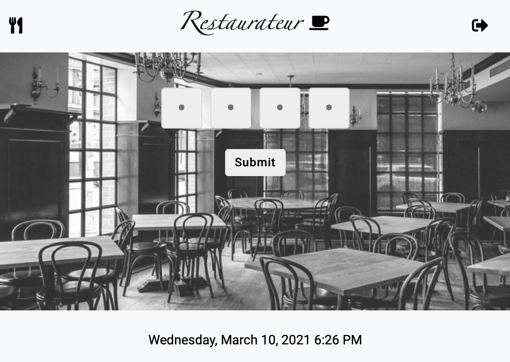
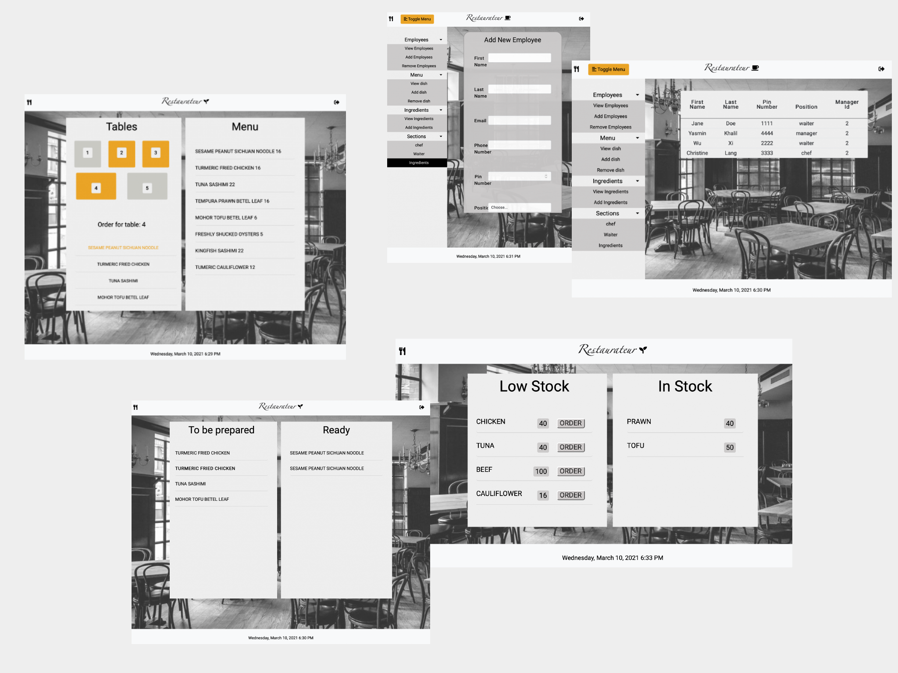

# Restaurateur

  ## Description
  

  A simple restaurant management app.

  

  

  ## Table of Contents

  * [Installation](#installation)
  * [Usage](#usage)
  * [License](#license)
  * [Contributing](#contributing)
  * [Questions](#questions)

  ## Installation
  Follow this :link: [Restaurateur](https://frozen-woodland-65100.herokuapp.com/) to use the app. 

  ## Usage
  Enter your pin number to be redirected to the correct page depending on your position.
  Pincodes to use to see the app at work: Waiter (1111), Chef (3333), Manager (4444).
  
  The waiter can view the Menu and order dishes by clicking on a table Number and a dish name.
  They can also change the availibility of a table by clicking on the table and delete the dishes once served.

  The Chef can view all the dishes to be prepared and with one click change their status to ready.
  
  The Manager can view, add and remove employees, dishes and ingredients. They can also access the ingredients page to re-order once the stock is low. The manager also has access to the waiter and chef page to monitor how everything is going.

  ## License
  This Source Code Form is subject to the terms of the  License. 
  If a copy of the License was not distributed with this file, You can obtain one at https://opensource.org/licenses

  ## Contributing
  Please fork the project and submit your changes for approval.

  ## Questions
  For further information please visit the Restaurateur GitHub:

  :link: https://github.com/wendyVo/Project02.git

  